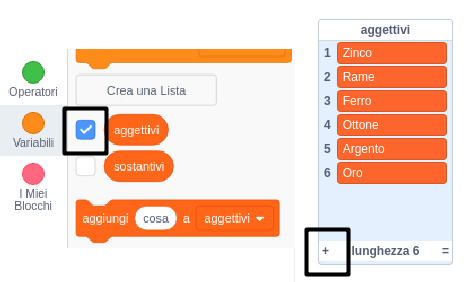

## Sfida: aggiungi più varietà

Riesci ad aggiungere altri vocaboli alle liste di aggettivi e sostantivi?

Spunta le caselle per mostrare le liste sullo Stage. Quindi fare clic sul **+** e digita una nuova parola nella lista. Non dimenticare di iniziare ogni parola con una lettera maiuscola.

Animali e creature reali e immaginarie andranno benissimo come `sostantivi` da aggiungere all'elenco. Prova a pensare a quelli più insoliti.

Ecco alcune idee per la lista degli `aggettivi`:

+ Metalli: Zinco, Rame, Ferro, Ottone, Argento, Oro
+ Colori: Crimisi, Acqua, Magenta, Dorato, Indaco
+ Pietre preziose: Quarzo, Smeraldo, Zaffiro, Diamante
+ Habitat: Luna, Deserto, Polo, Giungla, Foresta, Spazio

Ricordati di nascondere le liste dallo stage durante il test del tuo progetto.