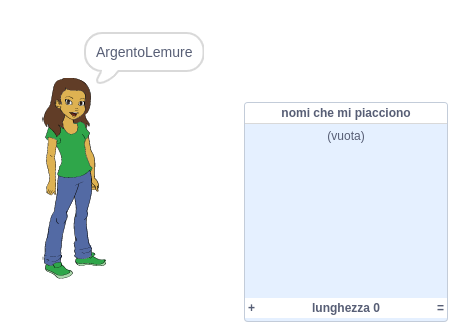
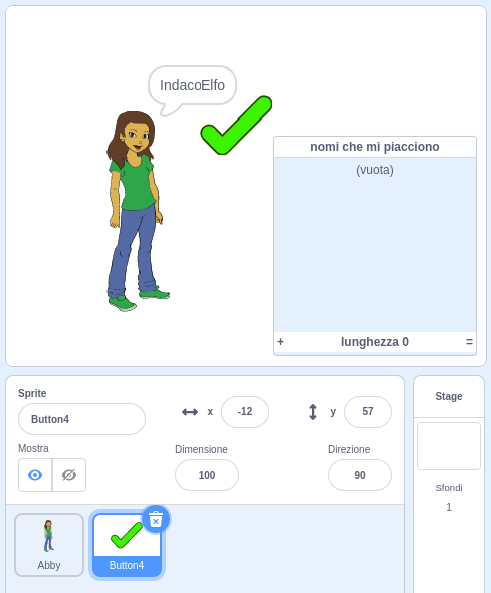
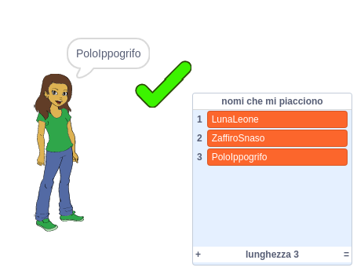
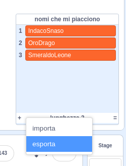

## Salvataggio degli username preferiti

Probabilmente vuoi poter valutare tra più username ottenuti. Aggiungiamo gli username che ti piacciono a un elenco.

--- task ---

Crea una nuova lista chiamata `nomi che mi piacciono`:

[[[generic-scratch3-make-list]]]

--- /task ---

--- task ---

L'elenco resterà visibile sullo Stage. Spostalo a destra dello sprite della tua persona e ingrandiscilo.



--- /task ---

--- task ---

Aggiungi lo sprite `Button4`, che assomiglia ad una <span style="color: green;">✔</span> e trascinalo sullo Stage a destra del fumetto.



Potrebbe essere necessario spostare la lista `nomi che mi piacciono` se lo sprite `Button4` è sotto di esso.

--- /task ---

--- task ---

Aggiungi il codice allo sprite del pulsante in modo che, quando si clicca, il nome utente corrente viene aggiunto a `nomi che mi piacciono`.


```blocks3
when this sprite clicked
add (username :: variables) to [nomi che mi piacciono v]
```

--- /task ---

--- task ---

Testa il tuo codice, facendo clic sullo sprite della persona fino a trovare un nome utente che ti piace e quindi facendo clic su <span style="color: green;">✔</span>.



--- /task ---

--- task ---

Puoi esportare il tuo elenco di username in un file di testo, per salvarli. Fai clic con il tasto destro del mouse sulla lista `nomi che mi piacciono` presente nello stage, fare clic su **Esporta** e scegli dove salvare il file contenente l'elenco.



Ora hai un file di testo contenente un elenco di nomi che puoi aprire con Blocco note o un altro editor di testo.

--- /task ---