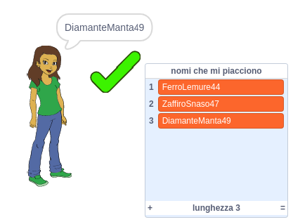

## Sfida: aggiungi un numero

Sui siti web e app popolari, può essere davvero difficile trovare uno username che qualcun altro non stia già utilizzando. Oppure potresti scoprire che lo username che usi su un sito, su altri è già occupato. Per aggirare il problema, puoi aggiungere un numero alla fine del tuo username. **Ricordati di non utilizzare l'età, la data di nascita o l'anno di nascita.**

Riesci ad usare i seguenti blocchi per generare username con un numero casuale alla fine?

```blocks3
set [username v] to [0]

join [hello] [world]

username :: variables

pick random (20) to (99)
```

I nuovi username generati dovrebbero ora avere numeri alla fine:

