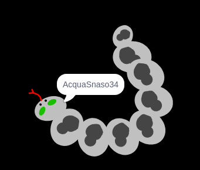

## Sfida: crea la tua immagine profilo

Puoi usare lo strumento di disegno di Scratch per creare la tua immagine profilo dallo username?

Ecco un esempio:

Utilizzare un programma di acquisizione dello schermo per salvare l'immagine in modo da poterla utilizzare su siti eeb o app che mostrano le immagini del profilo