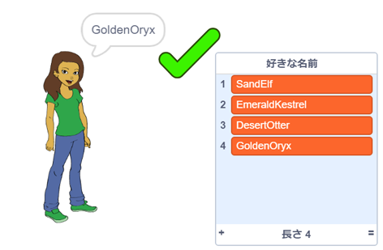

--- no-print ---

これはプロジェクトの**Scratch 3**バージョンです。 [Scratch 2バージョンのプロジェクト](https://projects.raspberrypi.org/ja-JP/projects/username-generator-scratch2)もあります。

--- /no-print ---

## はじめに

オンラインでのユーザー名には本名や個人情報 (こじんじょうほう) を使わないことが大切です。 このプロジェクトでは、Scratch のようなウェブサイトで使える、おもしろいユーザー名を生成します。

### 作るもの

--- no-print ---

これが完成 (かんせい) したプロジェクトです。

- 女の子のスプライトをクリックして、新しいユーザー名を生成します。
- ✔をクリックして、リストにユーザー名を追加 (ついか) します。

  <iframe allowtransparency="true" width="485" height="402" src="https://scratch.mit.edu/projects/embed/408399937/?autostart=false" frameborder="0" scrolling="no"></iframe>
  

--- /no-print ---

--- print-only ---

--- /print-only ---

--- collapse ---
---
title: 必要 (ひつよう) なもの
---

### ハードウェア

- Scratch を実行できるコンピュータ

### ソフトウェア

- Scratch 3（[オンライン](https://rpf.io/scratchon){:target="_blank"}または[オフライン](https://rpf.io/scratchoff){:target="_blank"}）

### ダウンロード

基本（きほん）のプロジェクトは [こちら](https://rpf.io/p/ja-JP/username-generator-go){:target="_blank"}にあります。

--- /collapse ---

--- collapse ---
---
title: 学ぶこと
---

- Scratch でのリストの使い方
- ペイントツールを使った画像 (がぞう) の作り方
- Scratch からテキストファイルと画像を書き出す方法

--- /collapse ---

--- collapse ---
---
title: 教育者向けの追加情報
---

--- no-print ---

このプロジェクトを印刷する必要がある場合は、[印刷用バージョン](https://projects.raspberrypi.org/ja-JP/projects/username-generator/print){:target="_ blank"}を使用してください。

--- /no-print ---

[完成したプロジェクトはこちら](https://rpf.io/p/ja-JP/username-generator-get){:target="_blank"}にあります。

--- /collapse ---
