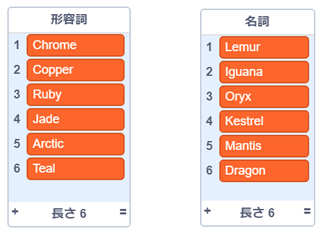
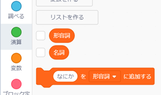
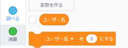
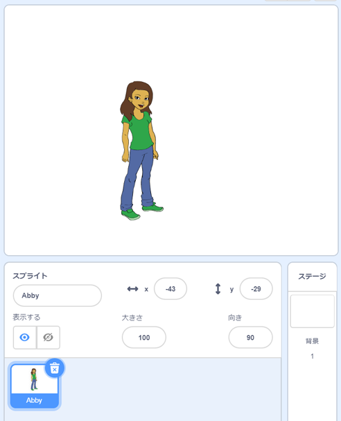

## ユーザー名の生成

ユーザー名を使って個人を特定 (とくてい) するウェブサイトやアプリはたくさんあります。 このユーザー名は他の人にも見えることが多いです。 ユーザー名はスクリーン名、ゲーマータグ、ハンドルネームともいいます。

ユーザー名が本名ではないこと、そして自分の年齢 (ねんれい) や誕生日 (たんじょうび)、住所といった個人情報をふくんでいないことが大切です。 あなたのユーザー名を他の人が見ることになるので、しつれいな名前でないかをたしかめましょう。そして、他の人があなたのユーザー名を読んだときにどう思うかを考えましょう。 ユーザー名は長い間使うかもしれないことをわすれないでください。3年たってもそのユーザー名を好きでいられますか？

このように、ユーザー名はしんちょうにえらぶことが大切です。 「ダイヤでできたイグアナ」（DiamondIguana）のような「形容詞 (けいようし)＋名詞 (めいし) 」のユーザー名を生成する Scratch プロジェクトをつくりましょう。

\--- task \---

基本（きほん）の Scratch プロジェクトを開きます。

**オンライン**: [rpf.io/usernameon](http://rpf.io/usernameon){:target="_blank"}から基本のプロジェクトを開きます。

Scratch アカウントを持っている場合は、**リミックス**ボタンをクリックしてプロジェクトをコピーできます。

**オフライン**: オフラインエディターで[基本のプロジェクト](http://rpf.io/p/en/username-generator-go){:target="_blank"}を開きます。

[rpf.io/scratchoff](http://rpf.io/scratchoff){:target="_blank"}から Scratch オフラインエディターをダウンロードしてインストールできます。

ステージ上に2つのリスト（`形容詞`と`名詞`）があります。



\--- /task \---

\--- task \---

**変数** (へんすう) をクリックして、`形容詞`と`名詞`の横にあるチェックボックスをクリックしてチェックを外し、リストを表示 (ひょうじ) しないようにします。



\--- /task \---

\--- task \---

**すべてのスプライトで**使えるように`ユーザー名`という名前の変数を追加します。

[[[generic-scratch3-add-variable]]]

\--- /task \---

\--- task \---

`ユーザー名`の横にあるチェックボックスをクリックし、チェックを外してステージに変数を表示しないようにします。



\--- /task \---

\--- task \---

人物のスプライトを追加しましょう。好きなものをえらんでかまいません。



**コスチューム**をクリックして好きなコスチュームもえらべます。

\--- /task \---

\--- task \---

人物のスプライトにこのコードを追加しましょう。


```blocks3
when this sprite clicked
set [username v] to []
```

\--- /task \---

\--- task \---

形容詞と名詞をつなげる必要があるので、`〜にする`{:class="block3variables"}ブロックに`〜と〜`{:class="block3operators"}ブロックを追加します。


```blocks3
when this sprite clicked
set [username v] to (join [apple] [banana] :: +)
```

\--- /task \---

\--- task \---

`〜と〜`{:class="block3operators"}ブロックの1番目のボックスに形容詞を追加します。


```blocks3
when this sprite clicked
set [username v] to (join (item (1) of [adjectives v] :: +) [banana])
```

\--- /task \---

\--- task \---

1から`形容詞の(リストの)長さ`{:class="block3variables"}までの`乱数`{:class="block3operators"} (らんすう) で形容詞をえらびます。(リストの1番目～最後にある形容詞の中から (この時点では6番目まで) 、ランダムにえらびます)


```blocks3
when this sprite clicked
set [username v] to (join (item (pick random (1) to (length of [adjectives v] :: +) :: +) of [adjectives v]) [banana])
```

\--- /task \---

\--- task \---

2番目のボックスにランダムにえらんだ名詞を追加します。


```blocks3
when this sprite clicked
set [username v] to (join (item (pick random (1) to (length of [adjectives v])) of [adjectives v]) (item (pick random (1) to (length of [nouns v] :: +) :: +) of [nouns v] :: +))
```

\--- /task \---

\--- task \---

次に、コードブロックを追加して人物がユーザ名を言うようにします。


```blocks3
when this sprite clicked
set [username v] to (join (item (pick random (1) to (length of [adjectives v])) of [adjectives v]) (item (pick random (1) to (length of [nouns v])) of [nouns v]))
+ say (username :: variables)
```

\--- /task \---

\--- task \---

人物のスプライトをクリックしてコードをテストしましょう。 毎回新しいユーザー名がランダムに表示されるはずです。


\--- /task \---