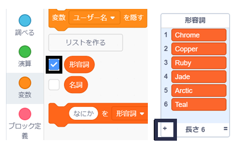

## チャレンジ: 単語をふやす

形容詞と名詞のリストにさらに単語を追加できますか？

リストのチェックボックスをクリックしてステージ上に表示します。 次に**+**アイコンをクリックして、リストに追加する新しい単語を入力します。 各単語の先頭を大文字にすることをわすれないでください。

`名詞`リストには、本物の動物や生き物、または想像 (そうぞう) 上の動物や生き物の名前がてきしています。 かわったものを考えてみましょう。

これは`形容詞`リスト用のアイデアです。

+ 金属 (きんぞく): Zinc（亜鉛（あえん））、Cooper（銅 (どう) ）、Iron（鉄）、Brass（真鍮（しんちゅう））、Gold（金）
+ 色: Crimson（真紅 (しんく) ）、Aqua（水色）、Magendta（赤紫（あかむらさき）色）、Golden（金色）、Indigo（藍（あい）色）
+ 宝石: Quartz（石英（せきえい））、Emerald（エメラルド）、Diamond（ダイヤモンド）
+ 生息地: Moon（月）、Desert（砂漠 (さばく) ）、Snow（雪）、Jungle（ジャングル）、Forest（森）、Space（宇宙 (うちゅう) ）

プロジェクトをテストするときは、ステージにリストを表示させないようにしましょう。