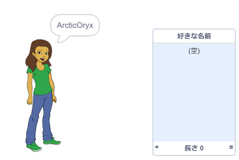
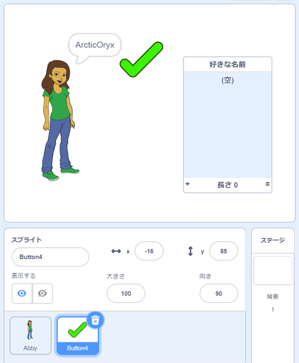
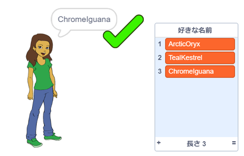
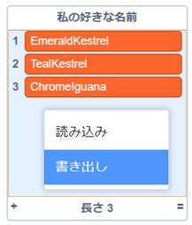

## 好きなユーザー名を保存する

ちがうユーザー名をいくつか考えてみたいと思うでしょう。 好きなユーザー名をリストに追加しましょう。

\--- task \---

`好きな名前`という新しいリストを作りましょう。

[[[generic-scratch3-make-list]]]

\--- /task \---

\--- task \---

リストがステージ上に表示されます。 リストを人物のスプライトの右にドラッグして、はばを広げます。



\--- /task \---

\--- task \---

<span style="color: green;">✔</span>のような`Button4` (ボタン4) スプライトを追加し、ふきだしの右にドラッグします。



`Button4`スプライトが`好きな名前`リストの下にある場合は、リストを動かす必要があるかもしれません。

\--- /task \---

\--- task \---

ボタンのスプライトにコードを追加して、スプライトがクリックされたら、今のユーザー名を`好きな名前`に追加するようにします。


```blocks3
when this sprite clicked
add (username :: variables) to [names I like v]
```

\--- /task \---

\--- task \---

好きなユーザー名が出てくるまで人物のスプライトをクリックし、その後に<span style="color: green;">✔</span>をクリックしてコードをテストしましょう。



\--- /task \---

\--- task \---

テキストファイルにエクスポートして、ユーザー名のリストを保存できます。 ステージにある`好きな名前`リストを右クリックして、**書き出し**をクリックし、ファイルとして保存する場所をえらびます。



メモ帳や他のテキストエディタで開くことができる、ユーザー名のリストをふくむテキストファイルが作成されています。

\--- /task \---