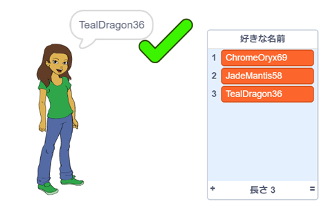

## チャレンジ: 数字を追加する

人気のあるウェブサイトやアプリでは、他のユーザーがまだ使っていないユーザー名を見つけるのがむつかしいことがあります。 あるいは、あるサイトで使っているユーザー名が他のサイトですでに使われていることに気づくかもしれません。 これをさけるには、ユーザー名の最後 (さいご) に数字を追加します。 **年齢や誕生日、生まれた年を使わないようにしてください。**

このブロックを使って、最後がランダムな数字になるユーザー名を生成できますか？

```blocks3
set [username v] to [0]

join [hello] [world]

username :: variables

pick random (20) to (99)
```

生成した新しいユーザー名の最後には数字がついているはずです。

