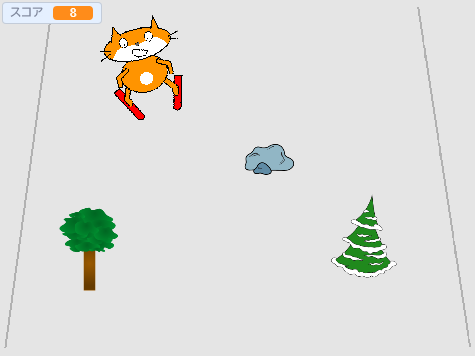

## 次は何をしましょうか？

Scratch プロジェクト [Scratchネコがスキーに行く](https://projects.raspberrypi.org/en/projects/scratch-cat-goes-skiing) を見てみましょう。

--- no-print ---

緑の旗（はた）をクリックしてスタートします。 左右の矢印 (やじるし) キーを使ってスキーヤーを動かします。

  <iframe allowtransparency="true" width="485" height="402" src="//scratch.mit.edu/projects/embed/281116583/?autostart=false" frameborder="0" scrolling="no"></iframe>
  

--- /no-print ---

--- print-only ---

--- /print-only ---
