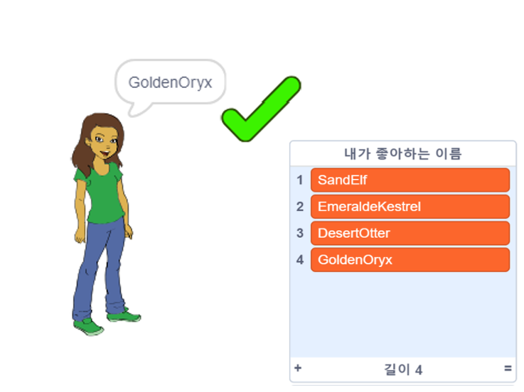

\--- no-print \---

이 프로젝트의 **스크래치 3** 버전입니다. [프로젝트의 스크래치 2 버전](https://projects.raspberrypi.org/en/projects/username-generator-scratch2)도 있습니다.

\--- /no-print \---

## 들어가며

온라인 사용자명에 실명이나 개인정보를 사용하지 않는 것이 중요합니다. 이 프로젝트에서는 스크래치와 같은 웹 사이트에서 사용할 수 있는 재미있는 사용자명을 생성합니다.

### 만들 작품

\--- no-print \---

완료된 프로젝트를 시도하려면:

- 여자 스프라이트를 클릭하여 새 사용자명을 생성하십시오.
- ✔ 을 클릭하여 원하는 사용자명을 목록에 추가하십시오.

  <iframe allowtransparency="true" width="485" height="402" src="https://scratch.mit.edu/projects/embed/292974184/?autostart=false" frameborder="0" scrolling="no"></iframe>
  

\--- /no-print \---

\--- print-only \---

\--- /print-only \---

## \--- collapse \---

## title: 준비물

### 하드웨어

- 스크래치를 실행할 수 있는 컴퓨터

### 소프트웨어

- 스크래치 3 ( [온라인](http://rpf.io/scratchon){:target="_ blank"} 또는 [offline](http://rpf.io/scratchoff){:target="_ blank"})

### 다운로드

The starter project can be found [here](https://rpf.io/p/en/username-generator-go){:target="_blank"}.

\--- /collapse \---

## \--- collapse \---

## title: 이런 것들을 배우게 됩니다.

- 스크래치에서 목록 사용하기
- 페인트 도구를 사용하여 이미지 만들기
- 스크래치에서 텍스트 파일 및 이미지를 내보내는 방법

\--- /collapse \---

## \--- collapse \---

## title: 교육자를 위한 추가 정보

\--- no-print \---

이 프로젝트를 인쇄하기 위해서는 [프린트용 버전](https://projects.raspberrypi.org/en/projects/username-generator/print){:target="_blank"}을 사용해 주십시오.

\--- /no-print \---

You can find the [completed project here](https://rpf.io/p/en/username-generator-get){:target="_blank"}.

\--- /collapse \---