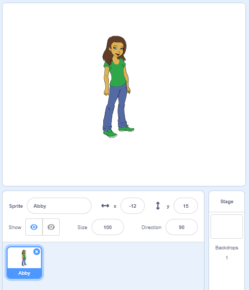

## 사용자명 만들기

사용자를 식별하기 위해 사용자명을 사용하는 웹 사이트와 앱이 많이 있습니다. 이 사용자명은 종종 다른 사람에게 표시됩니다. 사용자명은 화면 이름, 게이머 태그 또는 핸들이라고도 불립니다.

사용자명이 실명이 아니고 나이, 생년월일 또는 거주지와 같은 개인 정보도 포함하지 않는 것이 중요합니다. 다른 사람들이 귀하의 사용자명을 볼 수 있으므로 정중하게 작성하고 사람들이 읽을 때 귀하에 대해 어떻게 생각할지 고려하십시오. 사용자명을 오랫동안 사용하고 있을 수 있다는 것을 기억하십시오. 3년 후에도 계속 사용하시겠습니까?

보시다시피 사용자명을 신중하게 선택하는 것이 중요합니다. Scratch 프로젝트를 만들어 'DiamondIguana'와 같은 'AdjectiveNoun' 사용자명을 생성해 봅시다.

\--- task \---

스크래치 스타터 프로젝트를 엽니다.

**온라인**: [ rpf.io/usernameon](http://rpf.io/usernameon) {:target="_blank"}에서 스타터 프로젝트를 여세요.

스크래치 계정이있는 경우 ** Remix를 클릭 ** 하여 사본을 만들 수 있습니다.

**오프라인** : [스타터 프로젝트](http://rpf.io/p/en/username-generator-go){:target="_blank"} 를 오프라인 에디터에서 여세요.

스크래치 오프라인 에디터를 다운로드 받아야 하는 경우, [rpf.io/scratchoff](http://rpf.io/scratchoff){:target="_blank"} 에서 다운로드 받을 수 있습니다.

무대에서 두 개의 리스트를 볼 수 있을 것입니다. — `형용사` 그리고 `명사`:


\--- /task \---

\--- task \---

**변수**을 클릭 한 다음 `형용사` 및 `명사` 옆의 상자를 클릭하여 선택을 취소하고 목록을 숨깁니다.


\--- /task \---

\--- task \---

**모든 스프라이트**가 사용가능한 `사용자명`이라는 변수를 추가합니다.

[[[generic-scratch3-add-variable]]]

\--- /task \---

\--- task \---

`username` 옆의 상자를 클릭하여 선택을 취소하고 스테이지에서 변수를 숨깁니다.


\--- /task \---

\--- task \---

사람 스프라이트 추가 — 좋아하는 것을 선택할 수 있습니다.



**코스튬**을 클릭하고 원하는 코스튬을 선택할 수도 있습니다.

\--- /task \---

\--- task \---

이 코드를 사람 스프라이트에 추가해 보세요:


```blocks3
when this sprite clicked
set [username v] to []
```

\--- /task \---

\--- task \---

형용사와 명사를 결합해야 하므로, `결합하기`{:class="block3operators"} 블록을 `정하기`{:class="block3variables"} 블록 안에 추가하세요.


```blocks3
when this sprite clicked
set [username v] to (join [apple] [banana] :: +)
```

\--- /task \---

\--- task \---

`결합하기`{:class="block3operators"} 블록의 첫번째 상자에 형용사를 추가합니다.


```blocks3
when this sprite clicked
set [username v] to (join (item (1) of [adjectives v] :: +) [banana])
```

\--- /task \---

\--- task \---

1 사이의 `랜덤`{:class="block3operators"}한 형용사와 `형용사 목록의 길이`{:class="block3variables"} 를 고르세요.


```blocks3
when this sprite clicked
set [username v] to (join (item (pick random (1) to (length of [adjectives v] :: +) :: +) of [adjectives v]) [banana])
```

\--- /task \---

\--- task \---

두번째 상자에 임의의 명사를 추가하세요.


```blocks3
when this sprite clicked
set [username v] to (join (item (pick random (1) to (length of [adjectives v])) of [adjectives v]) (item (pick random (1) to (length of [nouns v] :: +) :: +) of [nouns v] :: +))
```

\--- /task \---

\--- task \---

이제 사용자가 사용자명을 말하도록 코드블록을 추가하세요.


```blocks3
when this sprite clicked
set [username v] to (join (item (pick random (1) to (length of [adjectives v])) of [adjectives v]) (item (pick random (1) to (length of [nouns v])) of [nouns v]))
+ say (username :: variables)
```

\--- /task \---

\--- task \---

사람 스프라이트를 클릭해서 코드를 테스트해보세요. 당신은 이제 매번 무작위의 사용자명을 갖게 될 것입니다.


\--- /task \---