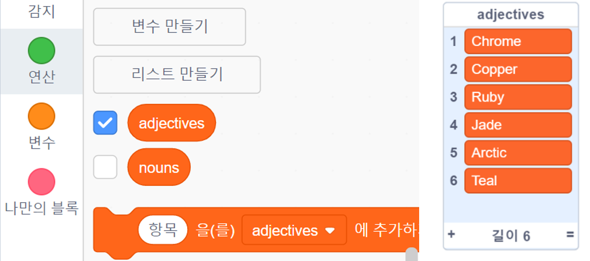

## 도전과제: 변수 더 추가하기

형용사 및 명사 목록에 더 많은 항목을 추가 할 수 있습니까?

목록의 박스를 선택하여 스테이지에 표시합니다. 그런 다음, **+** 아이콘을 클릭하고 목록에 새 단어를 입력하세요. 각 단어를 대문자로 시작하는 것을 잊지 마세요.

실제 및 가상의 동물과 생물은 `명사` 목록에서 잘 작동합니다. 특이한 것들을 생각해보세요.

다음은 `형용사` 목록에 대한 몇 가지 아이디어 입니다:

+ 금속: 아연, 구리, 철, 황동, 은, 금
+ 색상: 크림슨, 아쿠아, 마젠타, 골든, 인디고
+ 보석: 석영, 에메랄드, 사파이어, 다이아몬드
+ 서식지: 달, 사막, 눈, 정글, 숲, 우주

프로젝트를 테스트 할 때 스테이지에서 목록을 숨기는 것을 잊지 마세요.