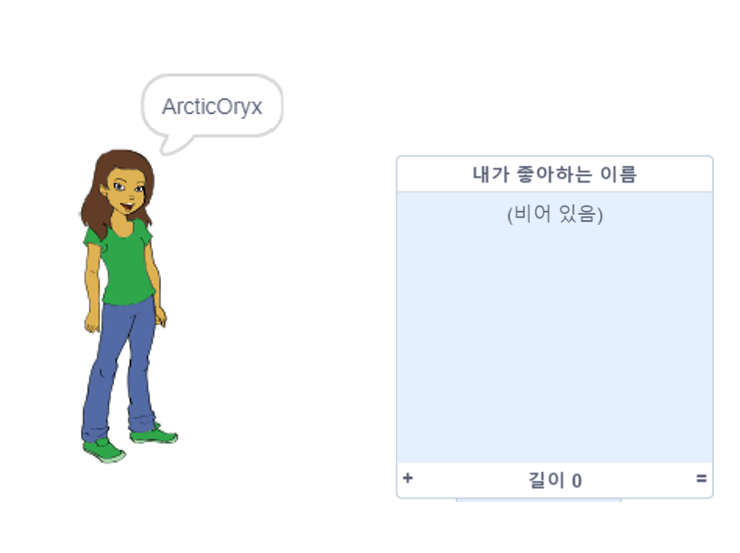
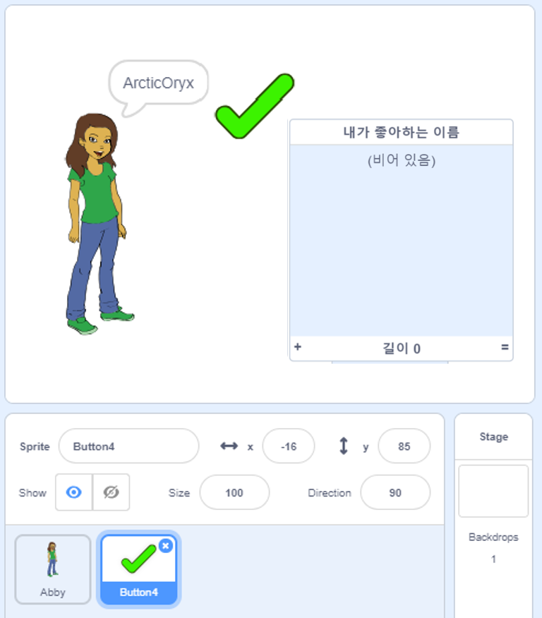
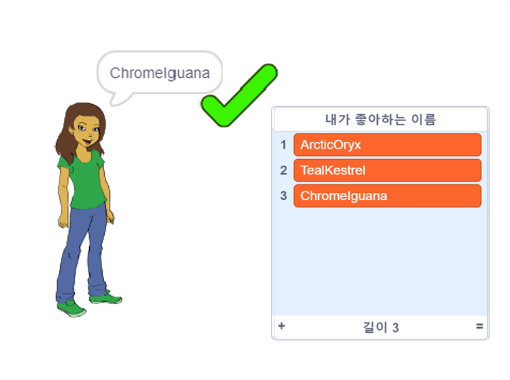
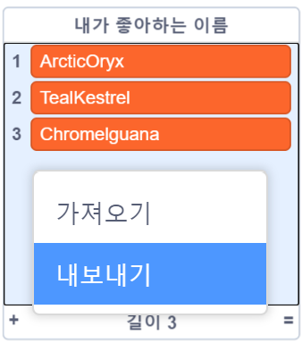

## 가장 좋아하는 사용자명 저장하기

몇 가지 다른 사용자명을 고려하고 싶을 것입니다. 좋아하는 사용자명을 목록에 추가해 보겠습니다.

\--- task \---

`내가 좋아하는 이름` 이라는 새 목록을 만듭니다.

[[[generic-scratch3-make-list]]]

\--- /task \---

\--- task \---

이 목록은 스테이지에 나타납니다. 사람 스프라이트의 오른쪽으로 드래그하여 더 넓게 합니다.



\--- /task \---

\--- task \---

<span style="color: green;">✔</span>으로 보이는 `버튼4` 스프라이트를 추가하고, 스테이지를 가로질러 말풍선 오른쪽으로 드래그합니다.



`버튼4` 스프라이트가 그 아래에 있는 경우, `내가 좋아하는 이름` 목록을 이동해야 할 수도 있습니다.

\--- /task \---

\--- task \---

클릭했을 때, 현재 사용자명이 `내가 좋아하는 이름` 에 추가되도록 버튼 스프라이트에 코드를 추가합니다.


```blocks3
when this sprite clicked
add (username :: variables) to [names I like v]
```

\--- /task \---

\--- task \---

좋아하는 사용자명을 찾을 때까지 사람 스프라이트를 클릭한 다음 <span style="color: green;">✔</span>을 클릭하여 코드를 테스트 합니다.



\--- /task \---

\--- task \---

사용자명 목록을 텍스트파일로 내보내서 저장할 수 있습니다. 스테이지에서 `내가 좋아하는 이름` 목록을 우클릭하고, **내보내기**를 클릭 한 후, 목록을 파일로 저장할 위치를 선택합니다.



이제 메모장이나 다른 텍스트 편집기로 열 수있는 이름 목록이 포함 된 텍스트 파일이 생겼습니다.

\--- /task \---