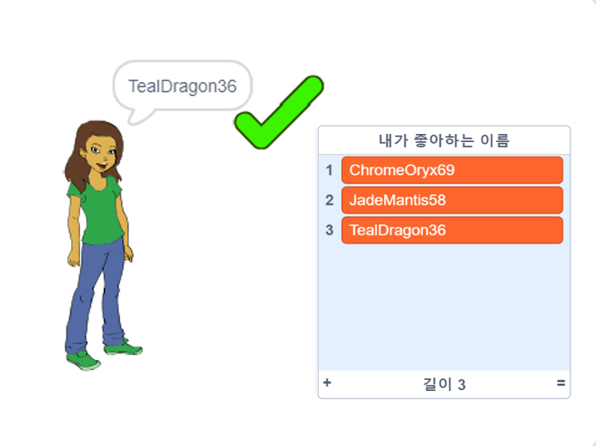

## 도전과제: 숫자 추가하기

인기있는 웹 사이트와 앱에서는 다른 사람이 이미 사용하고 있지 않은 사용자명을 찾기가 매우 어려울 수 있습니다. 또는 한 사이트에서 사용하는 사용자명이 이미 다른 사이트에서 사용되고 있음을 알 수 있습니다. 이 문제를 해결하기 위해 사용자명 끝에 숫자를 추가 할 수 있습니다. **본인의 나이, 생일 또는 태어난 년도를 사용하지 마십시오.**

다음 블록을 사용하여 끝에 임의의 숫자가 있는 사용자명을 생성 할 수 있나요?

```blocks3
set [username v] to [0]

join [hello] [world]

username :: variables

pick random (20) to (99)
```

생성한 새 사용자명은 이제 끝에 숫자가 있습니다:

