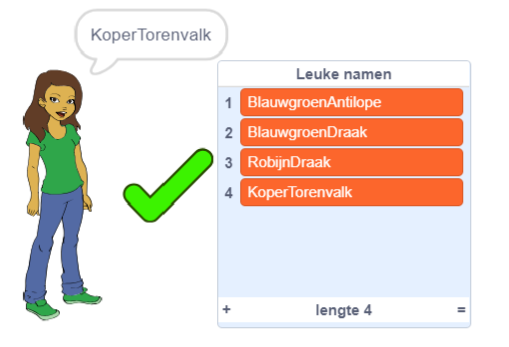

--- no-print ---

Dit is de **Scratch 3** versie van het project. Er is ook een [Scratch 2 versie van dit project](https://projects.raspberrypi.org/nl-NL/projects/username-generator-scratch2).

--- /no-print ---

## Inleiding

Het is belangrijk om je echte naam of persoonlijke informatie niet in je online gebruikersnaam te gebruiken. In dit project genereer je leuke gebruikersnamen die je kunt gebruiken op websites zoals Scratch.

### Wat ga je maken

--- no-print ---

Om het voltooide project uit te proberen:

- Klik op de meiden sprite om een nieuwe gebruikersnaam te genereren
- Klik op ✔ om een gewenste gebruikersnaam toe te voegen aan de lijst

  <iframe allowtransparency="true" width="485" height="402" src="https://scratch.mit.edu/projects/embed/389752662/?autostart=false" frameborder="0" scrolling="no"></iframe>
  

--- /no-print ---

--- print-only ---

--- /print-only ---

--- collapse ---
---
title: Wat heb je nodig
---

### Hardware

- Een computer die Scratch kan uitvoeren

### Software

- Scratch 3 ([online](http://rpf.io/scratchon){:target="_blank"} of [offline](http://rpf.io/scratchoff){:target="_blank"})

### Downloads

Het startproject kan [hier](http://rpf.io/p/nl-NL/username-generator-go){:target="_blank"} gevonden worden.

--- /collapse ---

--- collapse ---
---
title: Wat ga je leren
---

- Gebruik lijsten in Scratch
- Gebruik het tekengereedschap om afbeeldingen te maken
- Hoe tekstbestanden en afbeeldingen vanuit Scratch te exporteren

--- /collapse ---

--- collapse ---
---
title: Aanvullende informatie voor docenten
---

--- no-print ---

Als je dit project wilt afdrukken, gebruik dan de [printervriendelijke versie](https://projects.raspberrypi.org/nl-NL/projects/username-generator/print){:target="_blank"}.

--- /no-print ---

Je kunt het [voltooide project hier](http://rpf.io/p/nl-NL/username-generator-get){:target="_blank"} vinden.

--- /collapse ---