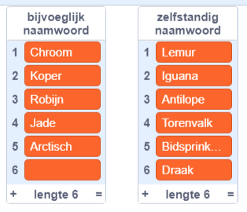
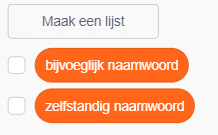
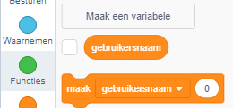
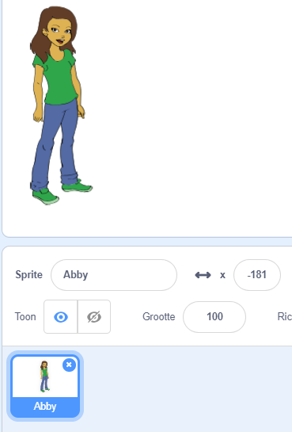
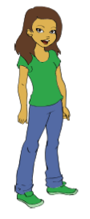
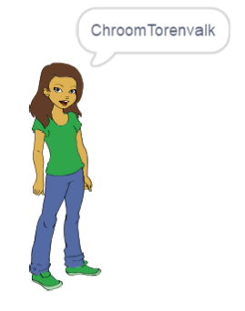

## Gebruikersnamen genereren

Er zijn veel websites en apps die een gebruikersnaam gebruiken om je te identificeren. Deze gebruikersnaam is vaak zichtbaar voor anderen. Gebruikersnamen kunnen ook schermnamen, gamer tags of handles worden genoemd.

Het is belangrijk dat je gebruikersnaam niet je echte naam is en ook geen persoonlijke informatie bevat, zoals je leeftijd, geboortejaar of waar je woont. Andere mensen zullen je gebruikersnaam zien, dus zorg ervoor dat deze beschaafd is en overweeg wat mensen over je zullen denken als ze hem lezen. Vergeet niet dat je je gebruikersnaam mogelijk heel lang zult gebruiken - vind je het over drie jaar nog leuk?

Zoals je ziet, is het belangrijk om je gebruikersnaam zorgvuldig te kiezen. Laten we een Scratch-project maken om 'BijvoeglijknaamwoordZelfstandignaamwoord' gebruikersnamen zoals 'ArctischIguana' te genereren.

--- task ---

Open het Scratch startproject.

**Online**: open het startproject via [scratch.mit.edu/projects/389753178](https://scratch.mit.edu/projects/389753178){:target="_blank"}.

Als je een Scratch-account hebt, kun je een kopie maken door op **Remix** te klikken.

**Offline**: open het [startproject](https://rpf.io/p/nl-NL/username-generator-go){:target="_blank"} in de offline editor.

Als je de Scratch offline editor wilt downloaden en installeren dan kan je die vinden op [rpf.io/scratchoff](https://rpf.io/scratchoff){:target="_blank"}.

Je zou twee lijsten op het podium moeten zien - `bijvoeglijke naamwoorden` en `zelfstandige naamwoorden`:



--- /task ---

--- task ---

Klik op **Variabelen** en klik vervolgens op de vakjes naast `bijvoeglijke naamwoorden` en `zelfstandige naamwoorden` om ze uit te vinken en de lijsten te verbergen.



--- /task ---

--- task ---

Voeg een variabele toe met de naam `gebruikersnaam` die beschikbaar moet zijn **voor alle sprites**.

[[[generic-scratch3-add-variable]]]

--- /task ---

--- task ---

Klik op het vakje naast `gebruikersnaam` om het uit te vinken en de variabele op het speelveld te verbergen.



--- /task ---

--- task ---

Voeg een persoon sprite toe - je kunt jouw favoriete kiezen.



Je kunt ook klikken op **Uiterlijken** en het gewenste uiterlijk kiezen.

--- /task ---

--- task ---

Voeg deze code toe aan je persoonlijke sprite:



```blocks3
wanneer op deze sprite wordt geklikt
maak [gebruikersnaam v] []
```

--- /task ---

--- task ---

Je moet een bijvoeglijk naamwoord en een zelfstandig naamwoord combineren, dus voeg een `voeg samen`{:class="block3operators"} blok toe binnen je `maak`{:class="block3variables"} blok.


```blocks3
wanneer op deze sprite wordt geklikt
maak [gebruikersnaam v] (voeg [appel] en [banaan] samen :: +)
```

--- /task ---

--- task ---

Voeg een bijvoeglijk naamwoord toe in het eerste vak in het blok `voeg samen`{:class="block3operators"}.


```blocks3
when this sprite clicked
set [gebruikersnaam v] to (join (item (1) of [bijvoeglijk naamwoord v] :: +) [banaan])
```

--- /task ---

--- task ---

Kies een `willekeurig`{:class="block3operators"} bijvoeglijk naamwoord tussen 1 en de `lengte van de bijvoeglijke naamwoordenlijst`{:class="block3variables"}


```blocks3
when this sprite clicked
set [gebruikersnaam v] to (join (item (pick random (1) to (length of [bijvoeglijk naamwoord v] :: +) :: +) of [bijvoeglijk naamwoord v]) [banaan])
```

--- /task ---

--- task ---

Voeg een willekeurig zelfstandig naamwoord toe in het tweede vak.


```blocks3
when this sprite clicked
set [gebruikersnaam v] to (join (item (pick random (1) to (length of [bijvoeglijk naamwoord v])) of [bijvoeglijk naamwoord v]) (item (pick random (1) to (length of [zelfstandig naamwoord v] :: +) :: +) of [zelfstandig naamwoord v] :: +))
```

--- /task ---

--- task ---

Voeg nu codeblokken toe om je sprite de gebruikersnaam te laten zeggen.


```blocks3
when this sprite clicked
set [gebruikersnaam v] to (join (item (pick random (1) to (length of [bijvoeglijk naamwoord v])) of [bijvoeglijk naamwoord v]) (item (pick random (1) to (length of [zelfstandig naamwoord v])) of [zelfstandig naamwoord v]))
+ say (gebruikersnaam :: variables)
```

--- /task ---

--- task ---

Test je code door op de sprite te klikken. Je zou elke keer een nieuwe willekeurige gebruikersnaam moeten krijgen.



--- /task ---
