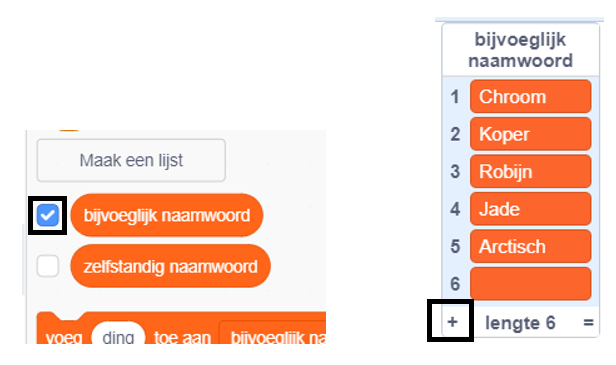

## Uitdaging: voeg meer variatie toe

Kun je meer items toevoegen aan de lijsten met bijvoeglijke naamwoorden en zelfstandige naamwoorden?

Vink de vakjes voor de lijsten aan om ze op het speelveld te tonen. Klik vervolgens op het pictogram **+** en typ een nieuw woord in de lijst. Vergeet niet om elk woord met een hoofdletter te beginnen.

Echte en denkbeeldige dieren en wezens werken goed in de lijst met `zelfstandige naamwoorden`. Probeer aan ongewone te denken.

Hier zijn enkele ideeën voor de lijst met `bijvoeglijke naamwoorden`:

+ Metalen: Zink, Koper, IJzer, Messing, Zilver, Goud
+ Kleuren: Roze, Blauw, Paars, Goud, Indigo
+ Edelstenen: Kwarts, Smaragd, Saffier, Diamant
+ Gebieden: Maan, Woestijn, Sneeuw, Jungle, Bos, Ruimte

Vergeet niet om de lijsten te verbergen voor het testen van je project.