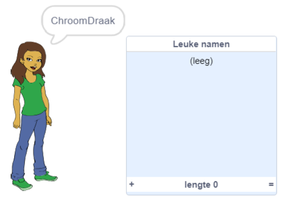
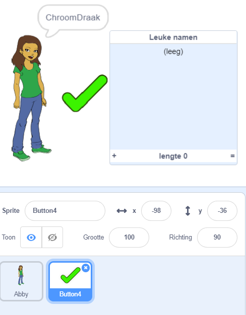
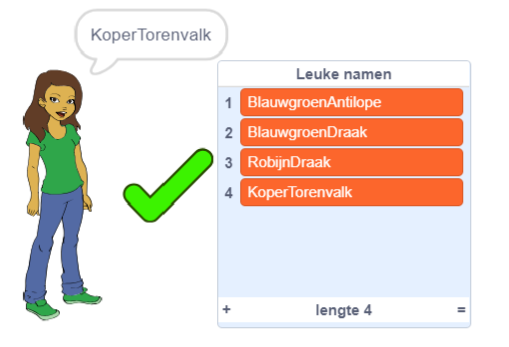
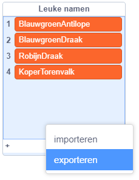

## Je favoriete gebruikersnamen opslaan

Je wilt waarschijnlijk een paar verschillende gebruikersnamen overwegen. Laten we gebruikersnamen die je leuk vindt aan een lijst toevoegen.

--- task ---

Maak een nieuwe lijst met de naam `Leuke namen`:

[[[generic-scratch3-make-list]]]

--- /task ---

--- task ---

De lijst verschijnt op het speelveld. Sleep het rechts van je sprite en maak het breder.



--- /task ---

--- task ---

Voeg de sprite `Button4`, die eruitziet als <span style="color: green;">✔</span>, en sleep deze over het speelveld rechts van de tekstballon.



Mogelijk moet je de lijst met `Leuke namen` verplaatsen als de sprite `Button4` eronder staat.

--- /task ---

--- task ---

Voeg code toe aan de knop sprite zodat, wanneer erop wordt geklikt, de huidige gebruikersnaam wordt toegevoegd aan `Leuke namen`.


```blocks3
wanneer op deze sprite wordt geklikt
voeg (gebruikersnaam :: variables) toe aan [Leuke namen v]
```

--- /task ---

--- task ---

Test je code door op de persoon sprite te klikken totdat je een gewenste gebruikersnaam vindt en klik vervolgens op <span style="color: green;">✔</span>.



--- /task ---

--- task ---

Je kunt je lijst met gebruikersnamen exporteren naar een tekstbestand om ze op te slaan. Klik met de rechtermuisknop op de `Leuke namen` lijst in het speelveld, klik op **Export** en kies een plaats om de lijst als bestand op te slaan.



Je hebt nu een tekstbestand met een lijst met namen die je kunt openen met Kladblok of een andere teksteditor.

--- /task ---