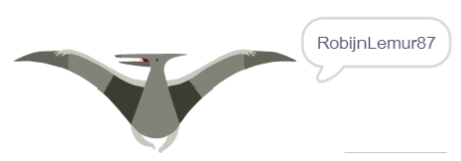

## Uitdaging: maak een profielfoto

Kun je het tekengereedschap in Scratch gebruiken om je eigen profielfoto te maken voor een gebruikersnaam?

Hier is een voorbeeld:

Gebruik een programma voor het vastleggen van screenshots om je foto op te slaan, zodat je deze kunt gebruiken op websites of apps die profielfoto's weergeven