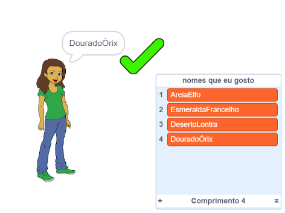

\--- no-print \---

Esta é a versão **Scratch 3** do projeto. Há também uma [versão Scratch 2 do projeto](https://projects.raspberrypi.org/en/projects/username-generator-scratch2).

\--- /no-print \---

## Introdução

É importante não usar seu nome real ou qualquer informação pessoal no seu nome de usuário online. Neste projeto, você irá gerar nomes de usuário divertidos que você pode usar em sites como o Scratch.

### O que você vai fazer

\--- no-print \---

Para experimentar o projeto concluído:

- Clique no ator garota para gerar um nome de usuário novo
- Clique no  ✔ para adicionar um nome de usuário que você gosta à lista

  <iframe allowtransparency="true" width="485" height="402" src="https://scratch.mit.edu/projects/embed/292974184/?autostart=false" frameborder="0" scrolling="no"></iframe>
  

\--- /no-print \---

\--- print-only \---

\--- /print-only \---

## \--- collapse \---

## title: O que você vai precisar

### Hardware

- Um computador capaz de executar o Scratch

### Software

- Scratch 3 ([online](http://rpf.io/scratchon){:target="_blank"} ou [offline](http://rpf.io/scratchoff){:target="_blank"})

### Downloads

O projeto inicial pode ser encontrado [aqui](http://rpf.io/p/en/username-generator-go){:target="_blank"}.

\--- /collapse \---

## \--- collapse \---

## title: O que você vai aprender

- Usar listas no Scratch
- Usar a ferramenta de pintura para criar imagens
- Como exportar arquivos de texto e imagens do Scratch

\--- /collapse \---

## \--- collapse \---

## title: Informações adicionais para educadores

\--- no-print \---

Se você precisar imprimir este projeto, por favor use a [versão para impressão](https://projects.raspberrypi.org/en/projects/username-generator/print){:target="_blank"}.

\--- /no-print \---

Você pode encontrar o [projeto concluído aqui](http://rpf.io/p/en/username-generator-get){:target="_blank"}.

\--- /collapse \---