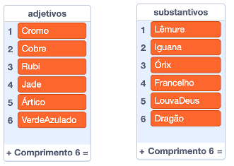
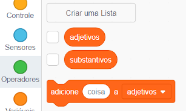
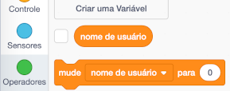
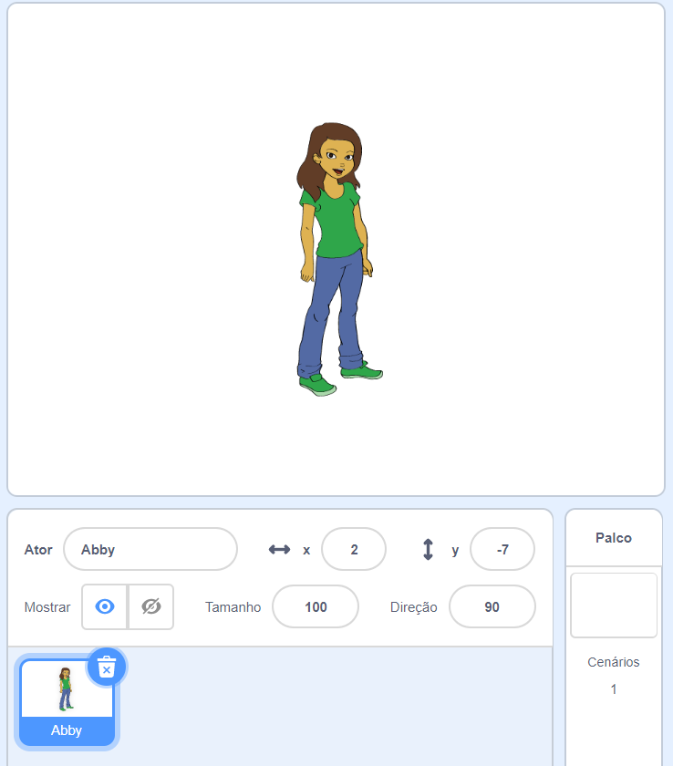
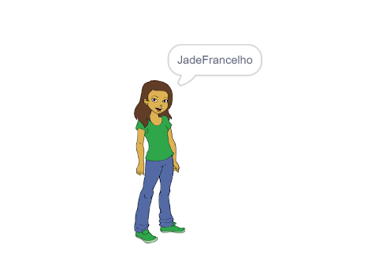

## Gerando nomes de usuário

Existem diversos sites e aplicativos que usam um nome de usuário para identificar você. Esse nome de usuário normalmente fica visível para outras pessoas. Nomes de usuário podem também ser chamados de nomes de tela, tags de jogador ou identificadores.

É importante que seu nome de usuário não seja seu nome real e também não inclua qualquer informação pessoal, como a sua idade, ano de nascimento, ou o lugar onde mora. Outras pessoas podem ver seu nome de usuário, portanto, seja educado e considere o que as pessoas vão pensar quando o lerem. Lembre-se que você poderá estar usando seu nome de usuário por um longo tempo — você ainda gostará dele daqui a três anos?

Como você pode ver, é importante ser cuidadoso na hora de escolher um nome de usuário. Vamos criar um projeto do Scratch para gerar nomes de usuário no formato 'AdjetivoSubstantivo' como 'DiamanteIguana'.

--- task ---

Abra o projeto inicial do Scratch.

**Online**: abra o projeto inicial em [scratch.mit.edu/projects/408398785](https://scratch.mit.edu/projects/408398785){:target="_blank"}.

Se você tiver uma conta Scratch, você pode fazer uma cópia clicando em **Remix**.

**Offline**: abra o [projeto inicial](https://rpf.io/p/pt-BR/username-generator-go){:target="_blank"} no editor offline.

Se você precisar baixar e instalar o editor offline do Scratch, você pode encontrá-lo em [rpf.io/scratchoff](https://rpf.io/scratchoff){:target="_blank"}.

Você deve ver duas listas no palco — `adjetivos` e `substantivos`:



--- /task ---

--- task ---

Clique em **Variáveis** e clique nas caixas ao lado de `adjetivos` e `substantivos` para desmarcá-los e ocultar as listas.



--- /task ---

--- task ---

Adicione uma variável chamada `nome de usuário` que deve estar disponível **para todos os atores**.

[[[generic-scratch3-add-variable]]]

--- /task ---

--- task ---

Clique na caixa ao lado de `nome de usuário` para desmarcá-la e ocultar a variável no palco.



--- /task ---

--- task ---

Adicione um ator pessoa — você pode escolher o seu favorito.



Você também pode clicar em **Fantasias** e escolher a fantasia que preferir.

--- /task ---

--- task ---

Adicione este código ao seu ator pessoa:


```blocks3
when this sprite clicked
set [nome de usuário v] to []
```

--- /task ---

--- task ---

Você precisa combinar um adjetivo e um substantivo, então adicione um bloco `junte`{:class="block3operators"} dentro do seu bloco `mude`{:class="block3variables"}.


```blocks3
when this sprite clicked
set [nome de usuário v] to (join [apple] [banana] :: +)
```

--- /task ---

--- task ---

Adicione um adjetivo na primeira caixa do bloco `junte`{:class="block3operators"}.


```blocks3
when this sprite clicked
set [nome de usuário v] to (join (item (1) of [adjetivos v] :: +) [banana])
```

--- /task ---

--- task ---

Escolha um adjetivo `aleatório`{:class="block3operators"} entre 1 e o `tamanho da lista de adjetivos`{:class="block3variables"}


```blocks3
when this sprite clicked
set [nome de usuário v] to (join (item (pick random (1) to (length of [adjetivos v] :: +) :: +) of [adjetivos v]) [banana])
```

--- /task ---

--- task ---

Adicione um substantivo aleatório na segunda caixa.


```blocks3
when this sprite clicked
set [nome de usuário v] to (join (item (pick random (1) to (length of [adjetivos v])) of [adjetivos v]) (item (pick random (1) to (length of [substantivos v] :: +) :: +) of [substantivos v] :: +))
```

--- /task ---

--- task ---

Agora adicione blocos de código para que sua pessoa diga o nome de usuário.


```blocks3
when this sprite clicked
set [nome de usuário v] to (join (item (pick random (1) to (length of [adjetivos v])) of [adjetivos v]) (item (pick random (1) to (length of [substantivos v])) of [substantivos v]))
+ say (nome de usuário :: variables)
```

--- /task ---

--- task ---

Teste seu código clicando no ator pessoa. Você deve obter um novo nome de usuário aleatório a cada vez.



--- /task ---
