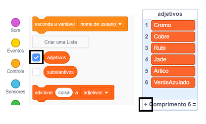

## Desafio: adicione mais variedade

Você pode adicionar mais itens às listas de adjetivos e substantivos?

Marque as caixas das listas para que elas apareçam no palco. Então, clique no ícone **+** e digite uma palavra nova na lista. Não esqueça de começar cada palavra com uma letra maiúscula.

Animais e criaturas reais e imaginárias funcionam bem na lista de `substantivos`. Tente pensar em alguns incomuns.

Aqui estão algumas ideias para a lista de `adjetivos`:

+ Metais: Zinco, Cobre, Ferro, Latão, Prata, Ouro
+ Cores: Carmesim, Água, Magenta, Dourado, Índigo
+ Pedras preciosas: Quartzo, Esmeralda, Safira, Diamante
+ Habitats: Lua, Deserto, Neve, Selva, Floresta, Espaço

Lembre-se de ocultar as listas do palco quando testar seu projeto.