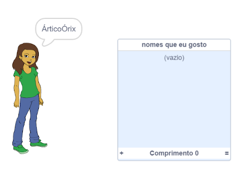
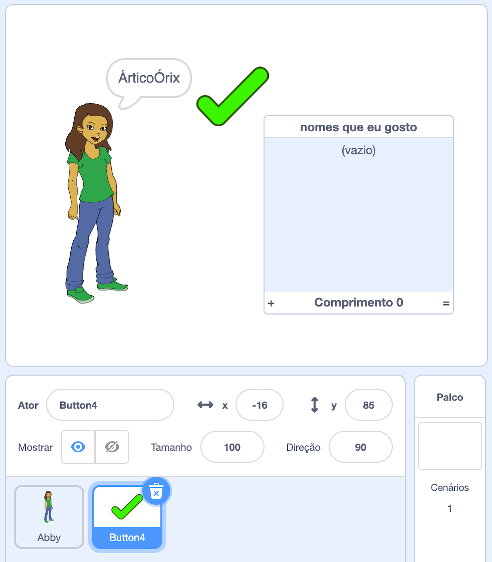
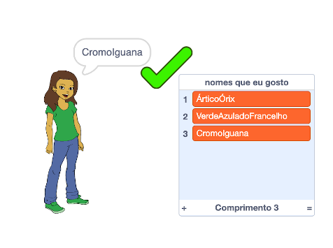
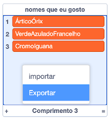

## Salvando seus nomes de usuário favoritos

Você provavelmente deseja considerar alguns nomes de usuário diferentes. Vamos adicionar nomes de usuário que você gosta a uma lista.

--- task ---

Crie uma nova lista chamada `nomes que eu gosto`:

[[[generic-scratch3-make-list]]]

--- /task ---

--- task ---

A lista aparecerá no palco. Arraste-a para a direita do seu ator pessoa e amplie-a.



--- /task ---

--- task ---

Adicione o ator `Button4`, que parece com <span style="color: green;">✔</span>, e arraste-o no palco até a direita do balão de diálogo.



Pode ser necessário mover a lista de `nomes que eu gosto` caso o ator `Button4` esteja embaixo dela.

--- /task ---

--- task ---

Adicione o código no ator botão para que ao ser clicado, o nome de usuário atual seja adicionado aos `nomes que eu gosto`.


```blocks3
when this sprite clicked
add (nome de usuário :: variables) to [nomes que eu gosto v]
```

--- /task ---

--- task ---

Teste seu código clicando no ator pessoa até você encontrar um nome de usuário que você goste e então clicando no <span style="color: green;">✔</span>.



--- /task ---

--- task ---

Você pode exportar sua lista de nomes de usuário para um arquivo de texto para salvá-los. Clique com o botão direito do mouse na lista de `nomes que eu gosto` no palco, clique em **Exportar** e escolha um local para salvar a lista como um arquivo.



Agora você possui um arquivo de texto com uma lista de nomes que você pode abrir com o Bloco de notas ou outro editor de texto.

--- /task ---