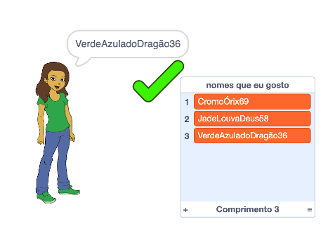

## Desafio: adicione um número

Em sites populares e aplicativos, pode ser realmente difícil encontrar um nome de usuário que outra pessoa não já esteja usando. Ou você pode descobrir que o nome de usuário que você usa em um site, já está sendo utilizado em outros sites. Para contornar isso, você pode adicionar um número ao final do seu nome de usuário. **Lembre-se de não usar sua idade, data de nascimento ou ano de nascimento.**

Você pode usar os blocos a seguir para gerar nomes de usuário com um número aleatório no final?

```blocks3
set [nome de usuário v] to [0]

join [hello] [world]

nome de usuário :: variables

pick random (20) to (99)
```

Os novos nomes de usuário que você gera agora devem ter números no final:

