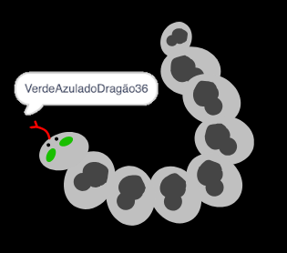

## Desafio: cria sua foto do perfil

Você pode usar a ferramenta de pintura no Scratch para criar sua própria foto do perfil para combinar com um nome de usuário?

Aqui está um exemplo:

Use um programa de captura de tela para salvar sua foto para que você possa usá-la em sites ou aplicativos que mostram fotos do perfil