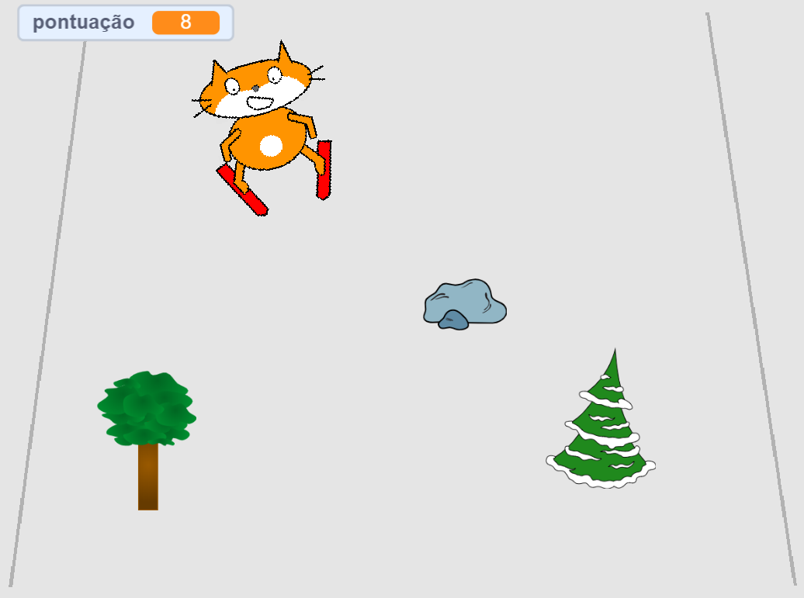

## E agora?

Dê uma olhada no projeto [O gato do Scratch vai esquiar](https://projects.raspberrypi.org/pt-BR/projects/scratch-cat-goes-skiing) do Scratch.

--- no-print ---

Clique na bandeira verde para começar. Use as setas para a esquerda e para a direita para controlar o esquiador.

  <iframe allowtransparency="true" width="485" height="402" src="//scratch.mit.edu/projects/embed/406836366/?autostart=false" frameborder="0" scrolling="no"></iframe>
  

--- /no-print ---

--- print-only ---

--- /print-only ---

***
Tradução Contribuída pela Comunidade

Este projeto foi traduzido por Eric Muniz e revisado por Douglas Reis.

Nossos incríveis voluntários de tradução nos ajudam a dar as crianças em todo o mundo a oportunidade de aprender a programar. Você pode nos ajudar a alcançar mais crianças traduzindo nossos projetos - leia mais em [rpf.io/translate](https://rpf.io/translate).
