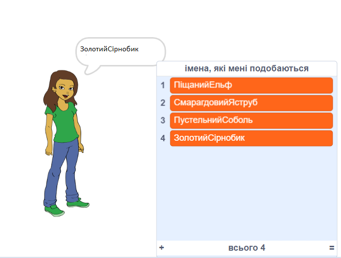

\--- no-print \---

Це — версія проєкту для **Скретч 3**. Також існує [версія проєкту для Скретч 2](https://projects.raspberrypi.org/en/projects/username-generator-scratch2).

\--- /no-print \---

## Вступ

Важливо не використовувати своє справжнє ім’я або будь-яку особисту інформацію в імені користувача онлайн. У цьому проєкті ти створиш цікаві імена користувачів, які зможеш використовувати на таких вебсайтах, як Скретч (Scratch).

### Що ти зробиш

\--- no-print \---

Щоб спробувати завершений проєкт:

- Натисни на спрайт дівчинки, щоб створити нове ім’я користувача
- Натисни ✔, щоб додати вподобане ім’я користувача до списку

  <iframe allowtransparency="true" width="485" height="402" src="https://scratch.mit.edu/projects/embed/292974184/?autostart=false" frameborder="0" scrolling="no"></iframe>
  

\--- /no-print \---

\--- print-only \---

\--- /print-only \---

## \--- collapse \---

## title: Що тобі знадобиться

### Обладнання

- Комп'ютер, що підтримує Скретч

### Програмне забезпечення

- Скретч 3 (або [онлайн](https://rpf.io/scratchon){:target="_blank"}, або [офлайн](https://rpf.io/scratchoff){:target="_blank"})

### Завантаження

Початковий проєкт можна знайти [тут](https://rpf.io/p/en/username-generator-go){:target="_ blank"}.

\--- /collapse \---

## \--- collapse \---

## title: Чого ти навчишся

- Використовувати списки в Скретч
- Використовувати інструмент малювання для створення зображень
- Як експортувати текстові файли та зображення зі Скретч

\--- /collapse \---

## \--- collapse \---

## title: Додаткова інформація для викладачів

\--- no-print \---

Якщо вам потрібно роздрукувати цей проєкт, будь ласка, скористайтеся [версією для друку](https://projects.raspberrypi.org/en/projects/username-generator/print){:target="_blank"}.

\--- /no-print \---

Ви можете знайти [завершений проєкт тут](https://rpf.io/p/en/username-generator-get){:target="_blank"}.

\--- /collapse \---