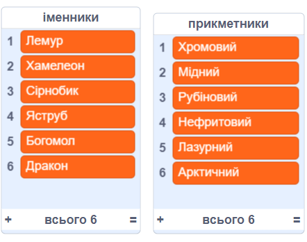
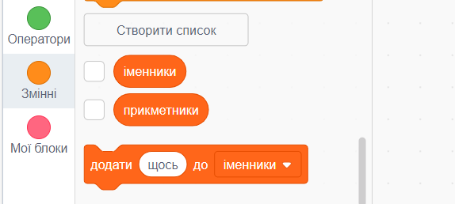
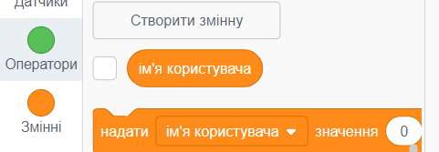
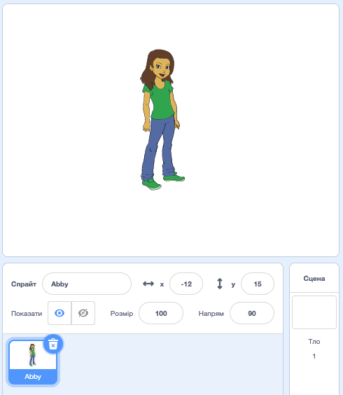
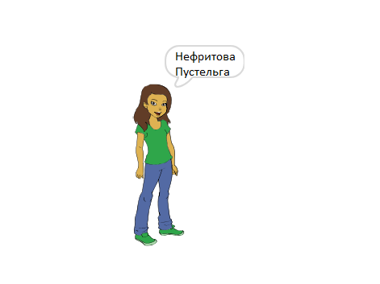

## Створення імен користувачів

Є багато вебсайтів і програм, які використовують ім'я користувача для твоєї ідентифікації. Це ім’я користувача часто видно іншим. Імена користувачів також можна називати екранними іменами, тегами гравців або маркерами.

Важливо, щоб ім’я користувача не було твоїм справжнім іменем, а також не містило жодної особистої інформації, як-от твій вік, рік народження або місце проживання. Інші люди бачитимуть твоє ім’я користувача, тому переконайся, що воно ввічливе, і врахуй те, що люди подумають про тебе, коли прочитають його. Пам’ятай, що можливо ти будеш використовувати своє ім’я користувача протягом тривалого часу — чи буде воно тобі подобатися через три роки?

Як бачиш, важливо ретельно вибирати ім’я користувача. Створімо проєкт на Скретч, щоб генерувати імена користувачів «ПрикметникІменник», наприклад «ДіамантоваІгуана».

--- task ---

Відкрий початковий проєкт на Скретч.

**Онлайн**: відкрий початковий проєкт на [rpf.io/usernameon](https://rpf.io/usernameon){:target="_blank"}.

Якщо у тебе є обліковий запис Скретч, то ти можеш зробити копію проєкту, натиснувши **Ремікс**.

**Офлайн**: відкрий [початковий проєкт](https://rpf.io/p/uk-UA/username-generator-go){:target="_blank"} в офлайн-редакторі.

Якщо тобі треба завантажити та встановити офлайн-редактор Скретч, ти можеш його знайти на [rpf.io/scratchoff](https://rpf.io/scratchoff){:target="_blank"}.

Ти маєш побачити два списки на сцені — `прикметники` та `іменники`:



--- /task ---

--- task ---

Натисни **Змінні**, а потім натисни на невеликий квадратик біля `прикметники` та `іменники`, щоб очистити прапорці та приховати списки.



--- /task ---

--- task ---

Додай змінну під назвою `ім’я користувача`, яка має бути доступна **для всіх спрайтів**.

[[[generic-scratch3-add-variable]]]

--- /task ---

--- task ---

Натисни невеликий квадратик біля `ім’я користувача`, щоб очистити прапорець і сховати змінну зі сцени.



--- /task ---

--- task ---

Додай спрайт людини — ти можеш вибрати свій улюблений.



Ти також можеш натиснути **Образи** і вибрати той, який тобі більш до вподоби.

--- /task ---

--- task ---

Додайте цей код до свого спрайту людини:


```blocks3
when this sprite clicked
set [ім'я користувача v] to []
```

--- /task ---

--- task ---

Тобі потрібно поєднати прикметник та іменник, тому додай блок `з’єднати`{:class="block3operators"} у свій блок `надати`{:class="block3variables"}.


```blocks3
when this sprite clicked
set [ім'я користувача v] to (join [яблуко] [банан] :: +)
```

--- /task ---

--- task ---

Додай прикметник у перше віконце блока `з’єднати`{:class="block3operators"}.


```blocks3
when this sprite clicked
set [ім'я користувача v] to (join (item (1) of [прикметники v] :: +) [банан])
```

--- /task ---

--- task ---

Вибери `випадковий`{:class="block3operators"} прикметник між 1 і `довжиною списку прикметників`{:class="block3variables"}


```blocks3
when this sprite clicked
set [ім'я користувача v] to (join (item (pick random (1) to (length of [прикметники v] :: +) :: +) of [прикметники v]) [банан])
```

--- /task ---

--- task ---

Додай випадковий іменник у друге віконце.


```blocks3
when this sprite clicked
set [ім'я користувача v] to (join (item (pick random (1) to (length of [прикметники v])) of [прикметники v]) (item (pick random (1) to (length of [іменники v] :: +) :: +) of [іменники v] :: +))
```

--- /task ---

--- task ---

Тепер додай блок коду, щоб твій спрайт міг вимовити ім'я користувача.


```blocks3
when this sprite clicked
set [ім'я користувача v] to (join (item (pick random (1) to (length of [прикметники v])) of [прикметники v]) (item (pick random (1) to (length of [іменники v])) of [іменники v]))
+ say (ім'я користувача :: variables)
```

--- /task ---

--- task ---

Протестуй свій код, натиснувши на спрайт людини. Щоразу ти маєш отримувати нове випадкове ім’я користувача.



--- /task ---