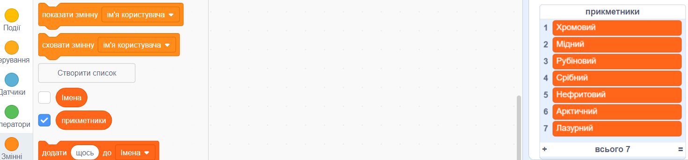

## Завдання: додати більше різноманітності

Чи можеш ти додати більше елементів до списків прикметників та іменників?

Постав прапорці у квадратиках біля списків, щоб вони відобразилися на сцені. Потім натисни іконку **+** і введи нове слово в список. Не забувай починати кожне слово з великої літери.

Справжні та уявні тварини та істоти добре підходять для списку `іменники`. Спробуй вигадати щось незвичайне.

Ось кілька ідей для списку `прикметників`:

+ Метали: Цинковий, Мідний, Залізний, Бронзовий, Срібний, Золотий, Хромовий
+ Кольори: Багряний, Водяний, Пурпуровий, Золотий, Лазурний, Зеленавий
+ Дорогоцінне каміння: Кварцовий, Смарагдовий, Сапфіровий, Діамантовий, Нефритовий, Рубіновий
+ Середовище проживання: Місячний, Пустельний, Арктичний, Джунглевий, Лісовий, Піщаний

Не забудь сховати списки зі сцени при тестуванні свого проєкту.