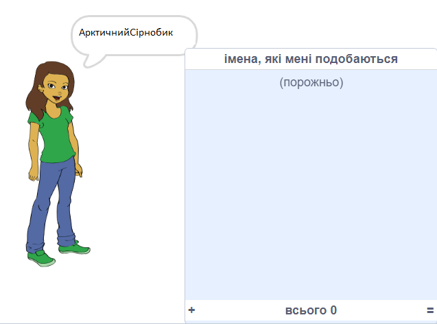
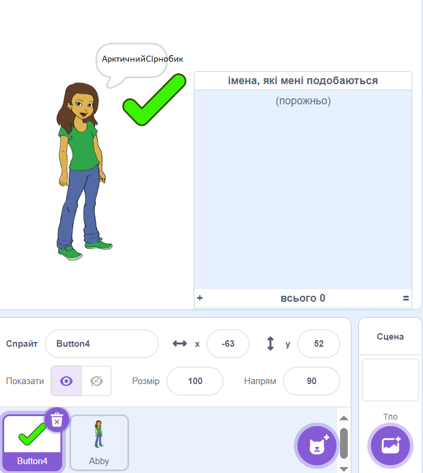
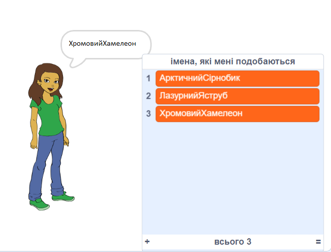
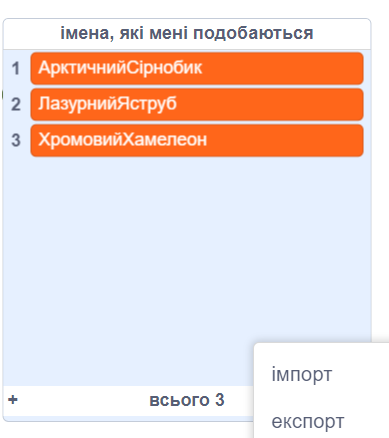

## Збереження вподобаних імен користувачів

Ймовірно, ти захочеш розглянути кілька різних імен користувачів. Додамо імена користувачів, які тобі подобаються, до списку.

\--- task \---

Створи новий список під назвою `імена, що мені подобаються`:

[[[generic-scratch3-make-list]]]

\--- /task \---

\--- task \---

Список з'явиться на екрані. Перетягни його праворуч від спрайта людини та зроби його ширшим.



\--- /task \---

\--- task \---

Додай спрайт кнопки `Button4 `, який виглядає як <span style="color: green;">✔️</span>, і перетягни його по сцені праворуч від хмарки репліки.



Тобі може знадобитися перемістити список `імена, що мені подобаються`, якщо спрайт `Button4` знаходитиметься під ним.

\--- /task \---

\--- task \---

Додай код до спрайта кнопки, щоб після її натискання поточне ім’я користувача додавалося до `імена, що мені подобаються`.


```blocks3
when this sprite clicked
add (username :: variables) to [names I like v]
```

\--- /task \---

\--- task \---

Протестуй свій код, натискаючи на спрайт людини, доки ти не знайдеш ім'я користувача, яке тобі подобається, а потім натисни на <span style="color: green;">✔️</span>.



\--- /task \---

\--- task \---

Ти можеш експортувати свій список імен користувачів у текстовий файл, щоб їх зберегти. Клацни правою кнопкою миші по списку `імена, що мені подобаються` на сцені, натисни **Експорт**, та вибери місце для збереження списку як файлу.



Тепер у тебе є текстовий файл, що містить список імен, які можна відкрити в Блокноті або іншому текстовому редакторі.

\--- /task \---