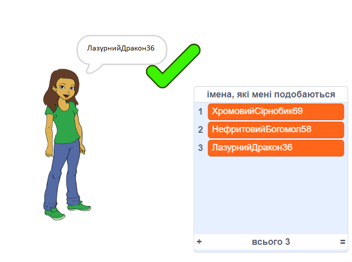

## Завдання: додати число

На популярних вебсайтах і в додатках може бути дуже важко знайти ім’я користувача, яке ще не використовує хтось інший. Або ти можеш виявити, що ім’я користувача, яке ти використовуєш на одному сайті, уже зайняте на інших. Щоб уникнути цього, ти можеш додати число в кінці свого імені користувача. **Пам'ятай не вказувати свій вік, дату або рік народження.**

Чи можеш ти використати ці блоки для створення імен користувачів з випадковим номером в кінці?

```blocks3
set [username v] to [0]

join [hello] [world]

username :: variables

pick random (20) to (99)
```

Створені тобою нові імена користувачів тепер повинні мати числа в кінці:

