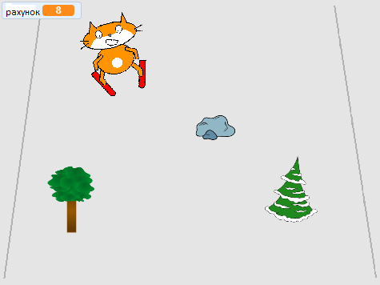

## Що далі?

Поглянь на Скретч проєкт [Скретч-кіт катається на лижах](https://projects.raspberrypi.org/uk-UA/projects/scratch-cat-goes-skiing).

--- no-print ---

Натисни на зелений прапорець, щоб почати. Використовуй клавіші зі стрілками вліво і вправо для керування лижником.

  <iframe allowtransparency="true" width="485" height="402" src="//scratch.mit.edu/projects/embed/281116583/?autostart=false" frameborder="0" scrolling="no"></iframe>
  

--- /no-print ---

--- print-only ---

--- /print-only ---
