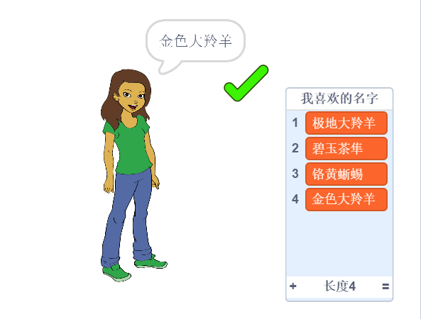

\--- no-print \---

这是该项目的 **Scratch 3** 版本。 项目</a>还有一个 Scratch 2版本。
 

\--- /no-print \---

## 简介

永远不要在网络账号中使用您的真实姓名或透露任何个人信息。 在这个项目中，您将学会生成可以在诸如Scratch等网站上使用的有意思的用户名。

### 学习成果

\--- no-print \---

试试已完成的项目：

- 点击女孩生成一个新的用户名
- 点击✔ 将您喜欢的用户名添加到列表中

  <iframe allowtransparency="true" width="485" height="402" src="https://scratch.mit.edu/projects/embed/292974184/?autostart=false" frameborder="0" scrolling="no"></iframe>
  

\--- /no-print \---

\--- print-only \---

\--- /print-only \---

## \--- collapse \---

## 标题: 你需要准备什么

### 硬件

- 一台能够运行 Scratch 的电脑

### 软件

- Scratch 3（[在线版本](http://rpf.io/scratchon){:target="_blank"}或[离线版本](http://rpf.io/scratchoff){:target="_blank"}）

### 下载

初始项目在[这里](http://rpf.io/p/en/username-generator-go){:target="_blank"}.

\--- /collapse \---

## \--- collapse \---

## title: 你将学到什么

- 在 Scratch 中使用列表
- 使用绘图工具创建图像
- 如何从 Scratch 导出文本文件和图像

\--- /collapse \---

## \--- collapse \---

## title: 为教育者提供的额外信息

\--- no-print \---

如果您需要打印本项目文件，请使用[适合打印版本](https://projects.raspberrypi.org/en/projects/username-generator/print){:target="_blank"}。

\--- /no-print \---

你可以在这里找到 [完成的项目](http://rpf.io/p/en/username-generator-get){:target="_blank"}。

\--- /collapse \---