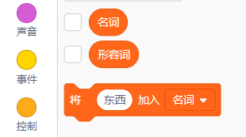

## 生成用户名

有许多网站和应用程序需要通过用户名来识别您。 用户名常常对其他人可见。 用户名也可以称为昵称、玩家标签 或者 手柄。

重要的是，您的用户名不能是真实姓名，也不能包含任何个人信息，比如年龄、出生日期或住址。 其他用户会看到您的用户名，因此请确保它是礼貌的，同时考虑当别人看到您的昵称时会联想到什么。 而且您的用户名将跟随您很长时间 — — 三年后您是否仍然喜欢它？

所以，要谨慎认真的选择用户名。 让我们创建一个Scratch项目可以生成类似于“钻石蜥蜴”这样“形容词+名词”组成的用户名。

\--- task \---

打开 Scratch 初始项目。

**在线：** 在 [rpf.io/usernameon](http://rpf.io/usernameon){：target =“_ blank”}打开初始项目。

如果您有Scratch帐户，可以单击 **Remix**制作副本。

在离线编辑器中**离线**: 打开 [初始项目](http://rpf.io/p/en/username-generator-go){:target="_blank"}.

如果您需要下载并安装Scratch离线编辑器，可以点击链接[ rpf.io/scratchoff ](http://rpf.io/scratchoff)获取 {：target="_blank"}。

舞台上应该显示两个列表 — — `形容词`和`名词`：


\--- /task \---

\--- task \---

点击**变量**，然后点击`形容词`和`名词`旁边的方框，取消选中它们来隐藏列表。



\--- /task \---

\--- task \---

添加一个名为 `用户名` 的变量，这个变量应对所有**角色**可用。

[[[generic-scratch3-add-variable]]]

\--- /task \---

\--- task \---

点击`用户名`旁边的方框取消选中使其在舞台中隐形。


\--- /task \---

\--- task \---

添加一个角色贴图——您可以选择任意一个您喜欢的。


您也可以点击**造型**选择您喜欢的角色造型。

\--- /task \---

\--- task \---

将下面的代码添加到人物角色中：


```blocks3
when this sprite clicked
set [username v] to []
```

\--- /task \---

\--- task \---

您需要合并一个形容词和一个名词，所以在您的`将...设为`{:class="block3operators"} 块中添加一个 `链接`{:class="block3variables"} 块。


```blocks3
when this sprite clicked
set [username v] to (join [apple] [banana] :: +)
```

\--- /task \---

\--- task \---

在 `链接`{:class="block3operators"} 块中添加一个形容词。


```blocks3
when this sprite clicked
set [username v] to (join (item (1) of [adjectives v] :: +) [banana])
```

\--- /task \---

\--- task \---

选择一个 `随机`{:class="block3operators"} 形容词，介于1和 `形容词列表长度`{:class="block3variables"} 之间。


```blocks3
when this sprite clicked
set [username v] to (join (item (pick random (1) to (length of [adjectives v] :: +) :: +) of [adjectives v]) [banana])
```

\--- /task \---

\--- task \---

在第二个框中添加一个随机的名词。


```blocks3
when this sprite clicked
set [username v] to (join (item (pick random (1) to (length of [adjectives v])) of [adjectives v]) (item (pick random (1) to (length of [nouns v] :: +) :: +) of [nouns v] :: +))
```

\--- /task \---

\--- task \---

现在添加代码块让您的角色说出用户名。


```blocks3
when this sprite clicked
set [username v] to (join (item (pick random (1) to (length of [adjectives v])) of [adjectives v]) (item (pick random (1) to (length of [nouns v])) of [nouns v]))
+ say (username :: variables)
```

\--- /task \---

\--- task \---

点击角色来测试您的代码。 您应该每次都获得一个新的随机用户名。


\--- /task \---