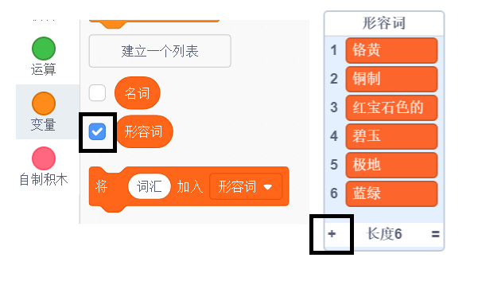

## 挑战：添加多样性

您能在形容词和名词列表中添加更多项目吗？

选中列表左边的方框将它们显示在舞台上。 然后点击 **+** 图标并在列表中输入一个新词。 不要忘了每个单词都以大写字母开头。

真实的动物和想象生物都可以添加在`名词`列表中。 试着添加新奇不常见的。

以下是`形容词`的一些备选词汇：

+ 金属：锌、铜、铁、黄铜、银、金。
+ 颜色：深红，浅绿，洋红，金色，靛蓝
+ 宝石：石英，绿宝石，蓝宝石，钻石
+ 栖息地：月亮，沙漠，雪域，丛林，森林，太空

在测试您的项目时记得在舞台上隐藏列表。