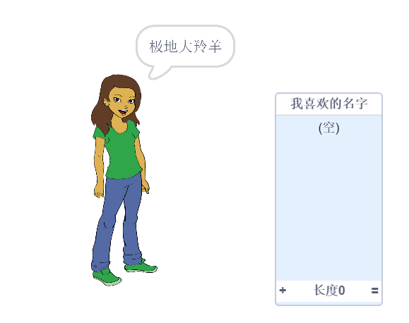
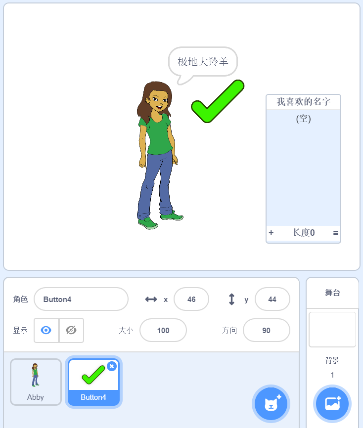
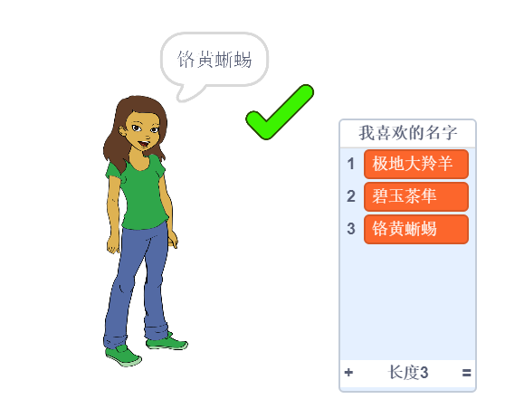
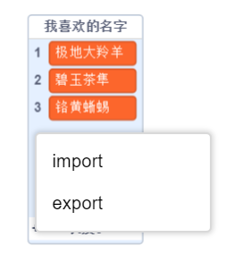

## 保存您最喜欢的用户名

您可能有几个备选的用户名。 我们把它们添加到一个列表里吧。

--- task ---

创建一个新列表叫做`我喜欢的名字`：

[[[generic-scratch3-make-list]]]

--- /task ---

--- task ---

列表会显示在舞台上。 拖它到人物的右边，再把列表拉宽一些。



--- /task ---

--- task ---

添加 `Button4` 贴图，它看起来像<span style="color: green;">✔</span>，把它拖动到语言气泡的右侧。



您可能需要移动`我喜欢的名字`列表，也许`Button4`贴图被挡在下边了。

--- /task ---

--- task ---

将代码添加到按钮精灵，这样当点击它时，当前用户名将被添加到`喜欢的名字`列表里。


```blocks3
when this sprite clicked
add (用户名 :: variables) to [我喜欢的名字 v]
```

--- /task ---

--- task ---

您可以一直单击个人物角色测试代码直到找到您喜欢的用户名，然后单击<span style="color: green;">✔</span>。



--- /task ---

--- task ---

您可以将用户名列表导出到文本文件来保存它们。 右键点击`我喜欢的名字`列表，点击**Export(导出)**，并选择一个地址将列表保存为文件。



您现在得到了一个包含名字列表的文本文件，您可以通过Notepad或其他文本编辑器打开它。

--- /task ---