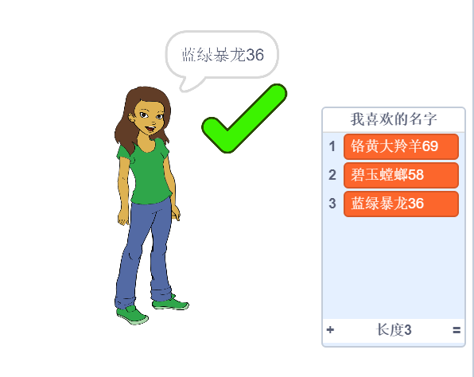

## 挑战：添加数字

一些非常受欢迎的网站和应用，很难找到一个别人没使用过的用户名。 或者您可能发现您在一个网站使用的用户名在其他网站已经有人用了。 您可以通过在用户名的末尾添加数字来解决这个问题。 **切记不要使用您的年龄、出生日期或出生年份。**

能不能用以下代码块来生成有随机编号的用户名？

```blocks3
set [username v] to [0]

join [hello] [world]

username :: variables

pick random (20) to (99)
```

您的新用户名现在应该在末尾有数字：

