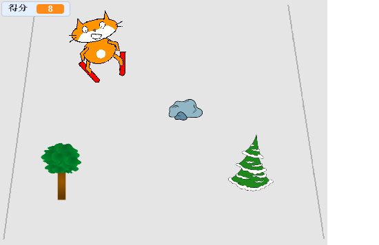

## 接下来还有什么？

试试看 [小猫滑雪](https://projects.raspberrypi.org/en/projects/scratch-cat-goes-skiing) Scratch 项目。

--- no-print ---

点击绿旗开始。 使用左右箭头控制滑雪者。

  <iframe allowtransparency="true" width="485" height="402" src="//scratch.mit.edu/projects/embed/281116583/?autostart=false" frameborder="0" scrolling="no"></iframe>
  

--- /no-print ---

--- print-only ---

--- /print-only ---
