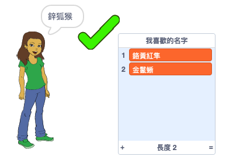

\--- no-print \---

這個專案是 **Scratch 3** 版本。 另外還有 [Scratch 2](https://projects.raspberrypi.org/en/projects/username-generator-scratch2) 版本。

\--- /no-print \---

## 介紹

請勿使用您的真實姓名或任何個人信息作為在線用戶名，這一點很重要。 在此項目中，您將創建可在Scratch等網站上使用的有趣用戶名。

### 您會做出：

\--- no-print \---

嘗試以下已完成的項目：

- 點擊圖中「女精靈」以生成新的用戶名
- 點擊 ✔ 將您喜歡的用戶名添加到清單中

  <iframe allowtransparency="true" width="485" height="402" src="https://scratch.mit.edu/projects/embed/292974184/?autostart=false" frameborder="0" scrolling="no"></iframe>
  

\--- /no-print \---

\--- print-only \---

\--- /print-only \---

## \--- collapse \---

## title: 您會用到

### 硬體

- 可運行 Scratch 的電腦

### 軟體

- Scratch 3 (either [online](https://rpf.io/scratchon){:target="_blank"} or [offline](https://rpf.io/scratchoff){:target="_blank"})

### 下載

The starter project can be found [here](https://rpf.io/p/en/username-generator-go){:target="_blank"}.

\--- /collapse \---

## \--- collapse \---

## title: 您會學到

- 在 Scratch 中使用清單
- 使用繪畫工具創建圖像
- 在 Scratch 中，怎樣匯出文字和圖像檔案

\--- /collapse \---

## \--- collapse \---

## title: 提供教師的補充資訊

\--- no-print \---

如果您需要列印此專案內容，請下載 [列印版本](https://projects.raspberrypi.org/en/projects/username-generator/print){：target =“_ blank”}。

\--- /no-print \---

You can find the [completed project here](https://rpf.io/p/en/username-generator-get){:target="_blank"}.

\--- /collapse \---