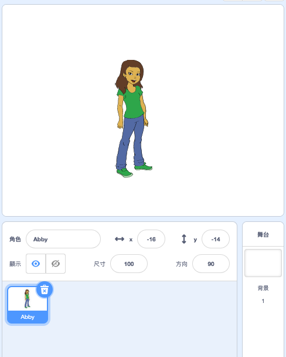

## 創建用戶名

許多網站和應用程式都需要使用用戶名來識別您的身份。 該用戶名通常對其他人是可見的。 用戶名也經常被稱為屏幕名稱，遊戲者標籤或手柄。

重要的是，您的用戶名應避免使用您的真實姓名，也不要包含任何個人信息，例如您的年齡，出生年份或居住地。 因其他人會看到您的用戶名，請確保它是有禮貌，並考慮其他人在閱讀時會如何看待您。 還有請記住，您可能會使用這個用戶名一段很長的時間 - 所以您最好想想三年後仍會喜歡它嗎？

由此可見，小心選擇用戶名是很重要的。 現在讓我們創建一個Scratch項目以生成包含「形容詞名詞」的用戶名，例如 「青銅羚羊」。

\--- task \---

打開Scratch入門專案。

**Online**: open the starter project at [rpf.io/usernameon](https://rpf.io/usernameon){:target="_blank"}.

如果您已經有 Scratch 帳戶，您可以直接**改編**專案。

**Offline**: open the [starter project](https://rpf.io/p/en/username-generator-go){:target="_blank"} in the offline editor.

If you need to download and install the Scratch offline editor, you can find it at [rpf.io/scratchoff](https://rpf.io/scratchoff){:target="_blank"}.

您應該在舞台上看到兩個列表 - `形容詞` 和 `名詞` ：


\--- /task \---

\--- task \---

點擊 **變數** ，然後點擊 `形容詞` 和 `名詞` 旁邊的框用以取消選中它們並隱藏列表。


\--- /task \---

\--- task \---

添加一個名為 `用戶名` 的變數，這個變數適用於**所有角色**。

[[[generic-scratch3-add-variable]]]

\--- /task \---

\--- task \---

點擊 `用戶名` 旁邊的框，用以取消選中它並在舞台上隱藏該變數。


\--- /task \---

\--- task \---

添加一個人物角色 - 您可以選擇自己所喜歡的。



您也可以點擊 **造型** 然後選擇您喜歡的服裝。

\--- /task \---

\--- task \---

為這角色編寫以下這個程式碼：


```blocks3
when this sprite clicked
set [username v] to []
```

\--- /task \---

\--- task \---

您需要組合一個形容詞和一個名詞，因此添加一個 `字串組合` {:class =“ block3operators”}塊到您的 `變數` {:class =“ block3variables”} 塊。


```blocks3
when this sprite clicked
set [username v] to (join [apple] [banana] :: +)
```

\--- /task \---

\--- task \---

把「形容詞」放入 `字串組合`{:class="block3operators"} 第一個框中。


```blocks3
when this sprite clicked
set [username v] to (join (item (1) of [adjectives v] :: +) [banana])
```

\--- /task \---

\--- task \---

在「運算」中，選擇 `隨機取數`{:class="block3operators"}，在 1 至 `形容詞清單`的長度{:class="block3variables"}。


```blocks3
when this sprite clicked
set [username v] to (join (item (pick random (1) to (length of [adjectives v] :: +) :: +) of [adjectives v]) [banana])
```

\--- /task \---

\--- task \---

添加一個隨機名詞到第二個「字串組合」框中。


```blocks3
when this sprite clicked
set [username v] to (join (item (pick random (1) to (length of [adjectives v])) of [adjectives v]) (item (pick random (1) to (length of [nouns v] :: +) :: +) of [nouns v] :: +))
```

\--- /task \---

\--- task \---

現在添加程式塊，讓您的用戶說出「用戶名」。


```blocks3
when this sprite clicked
set [username v] to (join (item (pick random (1) to (length of [adjectives v])) of [adjectives v]) (item (pick random (1) to (length of [nouns v])) of [nouns v]))
+ say (username :: variables)
```

\--- /task \---

\--- task \---

通過點擊人物精靈來測試您的程式碼。 您應該每次都獲得一個新的隨機用戶名。


\--- /task \---