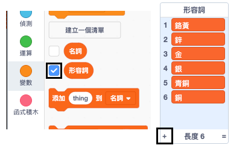

## 挑戰：多樣化

您可以在形容詞和名詞清單中添加更多項目嗎？

選中清單中的框把它們顯示在舞台上。 先點擊 **+** 圖標，然後在列表中輸入新單詞。 如用英文單詞，不要忘記每個單詞都以英文大寫字母開頭。

真實和虛構的動物和生物都已經在`名詞`清單上。 現在試想想一些不尋常的東西。

這是一些 `形容詞` 清單的例子：

+ 金屬類：鋅、銅、鐵、黃銅、銀、金
+ 顏色類：深紅色、水色、洋紅色、金色、靛藍色
+ 寶石類：石英、綠寶石、藍寶石、鑽石
+ 棲息地：月亮、沙漠、雪地、叢林、森林、太空

請記住，在測試項目時，在舞台上隱藏清單。