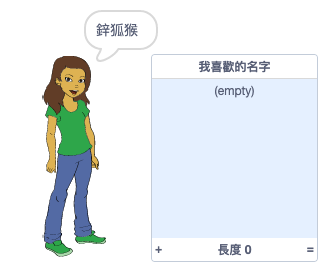
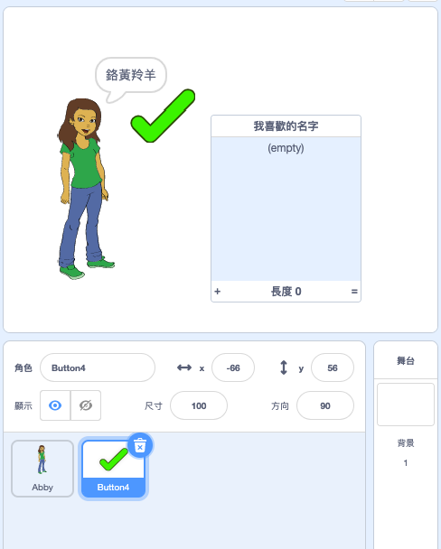
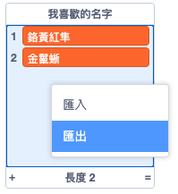

## 保存您喜歡的用戶名

您可能會考慮一些不同的用戶名。 讓我們將您喜歡的用戶名添加到清單中。

\--- task \---

創建一個名為 `我喜歡的名字` 的新清單：

[[[generic-scratch3-make-list]]]

\--- /task \---

\--- task \---

該清單將出現在舞台上。 將其拖動到「人形角色」的右側，使其更寬。



\--- /task \---

\--- task \---

添加 `Button4 ` 角色，看起來像 <span style="color: green;">✔</span> ，然後將它拖動到氣泡右側的舞台上。



您可能需要移動 `我喜歡的名字` 清單，不要讓` Button4` 在它的下面。

\--- /task \---

\--- task \---

將程式碼添加到按鈕角色中，以便在點擊它時將當前用戶名添加到 `我喜歡的名字` 中。


```blocks3
when this sprite clicked
add (username :: variables) to [names I like v]
```

\--- /task \---

\--- task \---

測試程式碼，點擊「人物角式」，直到找到所需的用戶名，然後點擊 <span style="color: green;">✔</span> 。


\--- /task \---

\--- task \---

您可以將用戶名清單匯出到文本文件以保存它們。 在舞台 `我喜歡的名字` 上右鍵點擊，選擇 **匯出** ，然後選擇將清單另存為文件的位置。



現在，您已把「我喜歡的名字」儲存到一個文字文件，您可使用「記事本」或其他文本編輯器打開它。

\--- /task \---