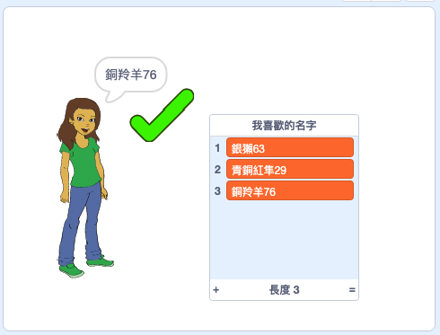

## 挑戰：加入數字

在流行的網站和應用程式上，一般很難找到其他人尚未使用的用戶名。 又或，您可能會發現您在一個網站上使用的用戶名已在其他網站上被其他人使用。 為了解決這個問題，您可以在用戶名的末尾添加一個數字。 **但請記住不要使用您的年齡，出生日期或出生年份。 **

您可以使用以下塊來生成結尾處帶有隨機數的用戶名嗎？

```blocks3
set [username v] to [0]

join [hello] [world]

username :: variables

pick random (20) to (99)
```

您生成的新用戶名現在應該在末尾帶有數字：

